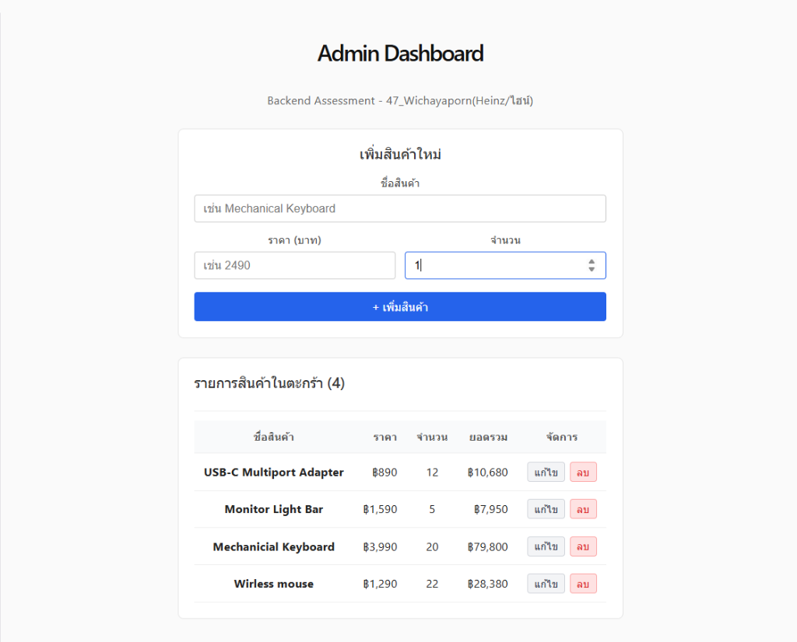

# My Understanding

---

## AI Code Contribution

| Rating | คำอธิบาย |
|---|---|
| 0 | **ไม่ได้ใช้ AI เลย** ฉันไม่ได้ใช้ AI สร้างโค้ด อธิบาย concept debug หรือสอนฉันเลย |
| 1 | **ใช้ AI เพื่อเรียนรู้เท่านั้น** ฉันไม่ได้ใช้ AI สร้างโค้ด แต่ใช้ AI ช่วยอธิบาย concept ไขข้อสงสัยเรื่อง error หรือช่วยให้เข้าใจมากขึ้น |
| 2 | **เขียนโค้ดเองผสมกับใช้ AI ช่วย** ฉันเขียนโค้ดเองบางส่วน และใช้โค้ดที่ AI สร้างบางส่วน รวมถึงใช้ AI ช่วยให้เข้าใจ debug หรือปรับปรุง solution ของฉัน |
| 3 | **เรียนรู้จากโค้ดที่ AI สร้าง แล้วเขียนเอง** AI สร้างโค้ดตัวอย่างหรือให้คำแนะนำ แต่ฉันใช้ความเข้าใจนั้นมาเขียนหรือปรับโค้ดสุดท้ายด้วยตัวเอง |
| 4 | **AI สร้างโค้ดให้ แต่ฉันเข้าใจมันอย่างครบถ้วน** AI สร้างโค้ดส่วนใหญ่หรือทั้งหมด แต่ฉันอธิบายได้ว่ามันทำงานอย่างไร ทำไมถึงทำงาน และส่วนหลัก ๆ เชื่อมกันอย่างไร |
| 5 | **AI สร้างโค้ดให้ แต่เข้าใจอย่างจำกัด** AI สร้างโค้ดส่วนใหญ่หรือทั้งหมด และฉันไม่สามารถอธิบายได้อย่างมั่นใจว่าทุกอย่างทำงานอย่างไรหรือทำไมถึงทำงาน |

**Rating ของฉัน:** 5

> ไฮน์เลือก Rating 5 เพราะโค้ดส่วนใหญ่ให้ AI ช่วยสร้างโครงสร้างและช่วยเขียนให้ ไฮน์เข้าใจภาพรวมและคอนเซปต์หลักๆ แต่ในรายละเอียดทางเทคนิคบางจุดไฮน์ยังเข้าใจได้อย่างจำกัด และกำลังเรียนรู้เพิ่มเติมค่ะ

---

## Backend

**1. HTTP method แต่ละตัวในแอปของคุณหมายถึงอะไร — GET, POST, PUT or PATCH, และ DELETE? ทำไมเราถึงใช้ method ต่างกัน แทนที่จะใช้ POST สำหรับทุกอย่าง?**
ในแอป shopping cart ของไฮน์ แต่ละ Method สื่อถึงเจตนาของการกระทำอย่างชัดเจนตามหลัก REST API ดังนี้ค่ะ:
- **GET (`/products`, `/products/:id`)**: ใช้สำหรับ "ขออ่านข้อมูล" ฝั่ง server แค่หยิบข้อมูลมาให้ดู ไม่มีการแก้ไขหรือลบของเดิมในระบบ
- **POST (`/products`)**: ใช้สำหรับ "สร้างข้อมูลใหม่" เป็นการส่งก้อนข้อมูลสินค้าชิ้นใหม่ไปต่อท้ายใน array บน server
- **PUT (`/products/:id`)**: ใช้สำหรับ "แก้ไข/อัปเดตข้อมูลที่มีอยู่เดิม" โดยระบุ id ของชิ้นที่จะแก้ แล้วส่งค่าใหม่ไปทับค่าเดิม
- **DELETE (`/products/:id`)**: ใช้สำหรับ "ลบข้อมูล" ระบุ id ของชิ้นที่ต้องการทิ้ง แล้ว server จะคัดออกจาก array

**ทำไมไม่ใช้ POST ทำทุกอย่าง?**
จริงๆ แล้วในทางเทคนิค POST สามารถส่ง body ไปบอก server ให้ทำอะไรก็ได้ แต่เหตุผลที่ไฮน์และนักพัฒนาสากลไม่ทำแบบนั้น เพราะ:
1. **ความชัดเจนและสื่อความหมาย (Semantics)**: แค่ดู Method ก็รู้ทันทีว่า request นี้กำลังจะอ่าน, สร้าง, แก้ หรือลบ ทำให้คนในทีมและคนที่มาต่อ API ทำงานง่าย
2. **Safe & Idempotent**: GET เป็น safe method แปลว่าเปิดดูซ้ำกี่ครั้งข้อมูลก็ไม่เปลี่ยน และ browser สามารถ cache ผลลัพธ์ได้ แต่ถ้าใช้ POST เปิดดู ข้อมูลอาจจะไม่ถูก cache และ browser จะถามเตือนเวลาเรากด back หรือ refresh
3. **มาตรฐานของ Web Ecosystem**: Tools ต่างๆ เช่น Browser, Proxy, API Gateway ถูกออกแบบมาให้จัดการ security และ network ตาม HTTP Method เช่น อนุญาตให้คนทั่วไป GET ได้ แต่สงวน POST/DELETE ไว้เฉพาะคนที่มีสิทธิ์

---

**2. `express.json()` คืออะไร และจะเกิดอะไรขึ้นถ้าคุณไม่ใส่มัน?**
`express.json()` คือ **built-in middleware** ของ Express ทำหน้าที่เป็น "ตัวแกะกล่องและแปลภาษา" ก้อนข้อมูล JSON ที่ client ส่งมาใน Request Body ค่ะ

ตอนที่ React ยิง fetch ด้วย `Content-Type: application/json` ข้อมูลที่วิ่งข้าม network มาถึง Express จะอยู่ในรูป raw string stream (สายอักขระดิบ) ถ้าเรา **ไม่ใส่** `app.use(express.json())` ตัว Express จะไม่รู้ว่าต้องแปลงสตริงนั้นเป็น object อย่างไร ผลลัพธ์คือตัวแปร `req.body` บน server จะกลายเป็น `undefined` ทันที พอเราเขียน `const { name, price } = req.body;` โค้ดจะ crash หรือแจ้ง error ว่าไม่สามารถอ่าน property ของ undefined ได้ค่ะ

---

**3. `req.body`, `req.params`, และ `req.query` ต่างกันอย่างไร? ยกตัวอย่างจริงจาก API ของคุณสำหรับแต่ละตัว**
ทั้งสามตัวเป็นช่องทางรับข้อมูลที่ client ส่งมาให้ server แต่ต่างกันตรงตำแหน่งและวัตถุประสงค์ค่ะ:
1. **`req.body`**: รับข้อมูลก้อนใหญ่ที่แนบมาในส่วนเนื้อหาของ HTTP Request (Request Body) นิยมใช้กับการสร้างหรือแก้ไขข้อมูล
   - ตอนยิง `POST /products` ไฮน์ดึงข้อมูลสินค้าใหม่มาใช้ `const { name, price, quantity } = req.body;`
2. **`req.params`**: รับค่าตัวแปรที่ฝังอยู่ใน URL Path โดยตรง ซึ่งถูกนิยามไว้ตอนสร้าง route ด้วยเครื่องหมายโคลอน `:`
   - ตอนเรียกดูหรือลบสินค้า เช่น `DELETE /products/1710000001` ตัวเลขไอดีจะถูกจับคู่กับ path `/products/:id` ทำให้ไฮน์ดึงมาใช้ได้ผ่าน `req.params.id`
3. **`req.query`**: รับค่าที่อยู่หลังเครื่องหมาย `?` ใน URL (Query String) โดยมาในรูป key=value มักใช้สำหรับ กรอง (filter), ค้นหา (search) หรือเรียงลำดับ (sort)
   - ใน route `GET /products?search=keyboard&sortBy=price` ไฮน์ดึงมาใช้ด้วย `const { search, sortBy } = req.query;` เพื่อนำคำค้นหาไปกรองชื่อสินค้า

---

**4. HTTP status codes คืออะไร? ระบุรายการ status code ทุกตัวที่คุณใช้ใน API และอธิบายว่าทำไมถึงเลือกใช้ในแต่ละสถานการณ์**
HTTP Status Code คือ "รหัสมาตรฐาน 3 หลัก" ที่ server ส่งกลับไปบอก client เพื่อสรุปผลสั้นๆ ว่า request นั้นสำเร็จหรือไม่ หรือมีปัญหาประเภทใดเกิดขึ้น โดยไม่ต้องรออ่านเนื้อความข้างใน

ในโปรเจกต์ของไฮน์ เลือกใช้ดังนี้ค่ะ:
- **`200 OK`**: ใช้เมื่อคำขอสำเร็จตามปกติ เช่น `GET /products` (ดึงข้อมูลสำเร็จ), `PUT /products/:id` (แก้ไขสำเร็จ), `DELETE /products/:id` (ลบสำเร็จ)
- **`201 Created`**: ใช้เจาะจงเมื่อเกิด "การสร้าง Resource ชิ้นใหม่บน server สำเร็จ" ไฮน์ใช้ใน `POST /products` หลังจาก push สินค้าใหม่เข้า array เรียบร้อยแล้ว
- **`400 Bad Request`**: ใช้เมื่อปัญหาเกิดจาก "Client ส่งข้อมูลมาไม่ถูกต้อง" เช่น ลืมกรอกชื่อสินค้า, ไม่ได้ใส่ราคา, หรือส่งราคาติดลบมา ไฮน์จะตอบ 400 พร้อมบอกว่าฟิลด์ไหนผิด
- **`404 Not Found`**: ใช้เมื่อ "หาของที่ขอไม่เจอ" เช่น ยิง `GET /products/999` แล้วใน array ไม่มีสินค้า id นี้ หรือผู้ใช้พิมพ์ URL route ที่ไม่มีอยู่จริง
- **`500 Internal Server Error`**: ใช้ใน error-handling middleware กรณีเกิด bug ที่ไม่ได้ดักไว้ล่วงหน้า เพื่อแจ้งว่าฝั่ง server เกิดข้อผิดพลาดภายใน

---

**5. middleware คืออะไร? อธิบายด้วยคำพูดของคุณเองว่ามันทำอะไร พร้อมยกตัวอย่าง 1 อย่างจากโค้ดของคุณ**
สำหรับไฮน์ Middleware เปรียบเหมือน **"ด่านตรวจ" หรือ "คนกลาง"** ที่ยืนอยู่ตรงทางเดินระหว่างที่ Request วิ่งเข้ามา ก่อนจะไปถึง Route Handler ปลายทาง ตัว middleware สามารถตรวจสอบ, แก้ไข, ดัดแปลง request/response หรือแม้กระทั่งสั่งหยุด request กลางคันถ้าไม่ผ่านเกณฑ์ แล้วเรียกฟังก์ชัน `next()` เพื่อส่งไม้ต่อไปยังด่านถัดไป

ไฮน์สร้าง **Request Logger Middleware** ไว้ต้น chain:
```javascript
app.use((req, res, next) => {
  const timestamp = new Date().toLocaleTimeString("th-TH");
  console.log(`[${timestamp}] ${req.method} ${req.originalUrl}`);
  next(); // สำคัญมาก: ถ้าไม่เรียก next() request จะค้างเติ่งอยู่ตรงนี้ ไม่ยอมเดินไปถึง route handler
});
```
Middleware ตัวนี้จะคอยจดบันทึกทุกครั้งที่มีคนยิงเข้ามาว่าใช้ method อะไร เวลาเท่าไหร่ ช่วยให้ไฮน์ debug เช็คเส้นทางได้สะดวกมากค่ะ

---

**6. ทำไม order ของ middleware ใน Express ถึงสำคัญ? จะเกิดอะไรขึ้นถ้า order ผิด?**
Express ทำงานแบบ **ลำดับก่อน-หลัง (Sequential Pipeline)** ตามที่เขียนเรียงจากบนลงล่าง Request จะไหลผ่าน middleware ทีละตัวตามลำดับที่ประกาศไว้ ดังนั้น ลำดับจึงมีความสำคัญอย่างยิ่งค่ะ

**ถ้าเรียงลำดับผิดจะเกิดอะไรขึ้น?**
1. **ถ้าเอา `express.json()` ไปวางไว้ใต้ Route**: ตอนที่ route ทำงาน `req.body` จะยังคงเป็น `undefined` เพราะ middleware แกะ JSON ยังไม่ได้ทำงานก่อนหน้า
2. **ถ้าเอา Error-handling middleware ไปไว้บนสุด**: มันจะไม่สามารถจับ error จาก route ไหนได้เลย เพราะ error middleware มีหน้าที่รอรับ error ที่ถูกส่งต่อมาด้วย `next(err)` จากชั้นก่อนหน้า มันจึงต้องอยู่ท้ายสุดของ chain เสมอ

---

**7. อธิบายทีละขั้นตอนว่าเกิดอะไรขึ้นบน server เมื่อมี POST request ถูกส่งไปที่ `/products`**
เมื่อมี POST request ยิงเข้ามาที่ `/products` บน server ของไฮน์ ลำดับเหตุการณ์จะเกิดขึ้นทีละขั้นดังนี้ค่ะ:
1. **ผ่าน CORS Middleware**: เช็ค origin ของ client ว่าได้รับอนุญาตหรือไม่ (ผ่าน)
2. **ผ่าน `express.json()`**: อ่าน JSON string จาก body แล้วแปลงเป็น JavaScript object ยัดใส่ `req.body`
3. **ผ่าน Logger Middleware**: ปริ้นท์ log ออก console ว่ามี `POST /products` เข้ามา แล้วเรียก `next()`
4. **เข้ามาที่ Route Handler `app.post("/products", ...)`**:
   - ดึง `name`, `price`, `quantity` ออกมาจาก `req.body`
   - ตรวจสอบความถูกต้อง (Validation): ถ้า `name` ไม่มีหรือว่างเปล่า หรือ `price` น้อยกว่า 0 ให้ return ทันทีด้วย status `400` พร้อมข้อความเตือน
   - ถ้าข้อมูลถูกต้อง: นำมาสร้าง object สินค้าใหม่ โดยใส่ `id: String(Date.now())` และตั้ง default `quantity = 1` หากไม่ได้ส่งมา
   - สั่ง `products.push(newProduct)` เพื่อบันทึกลง in-memory array
5. **ส่ง Response กลับ**: server สั่ง `res.status(201).json(newProduct)` เพื่อตอบกลับ client พร้อมรหัส 201 Created และส่ง object สินค้าที่เพิ่งสร้างสำเร็จกลับไป

---

**8. CRUD คืออะไร? จับคู่แต่ละ operation กับ HTTP method และ route ที่คุณใช้ใน API**
CRUD ย่อมาจาก 4 การทำงานพื้นฐานของระบบจัดการข้อมูลใดๆ ซึ่งใน API ของไฮน์จับคู่ได้ดังนี้ค่ะ:
- **C - Create (สร้าง)**: คู่กับ **`POST /products`** (รับข้อมูลชิ้นใหม่ไปเพิ่มในระบบ)
- **R - Read (อ่าน/ดู)**: คู่กับ **`GET /products`** (ดูทั้งหมด) และ **`GET /products/:id`** (ดูชิ้นเดียวตาม id)
- **U - Update (แก้ไข)**: คู่กับ **`PUT /products/:id`** (อัปเดตข้อมูลของชิ้นที่ระบุ)
- **D - Delete (ลบ)**: คู่กับ **`DELETE /products/:id`** (ลบสินค้าชิ้นนั้นออกจากระบบ)

---

**9. API ของคุณตอบสนองอย่างไรเมื่อมีอะไรผิดพลาด — เช่น เมื่อ product ตาม ID ที่ระบุไม่มีอยู่จริง?**
เมื่อมีข้อผิดพลาดเกิดขึ้น API ของไฮน์จะไม่ปล่อยให้ระบบเงียบหรือส่งหน้าเว็บ HTML เปล่าๆ กลับไป แต่จะตอบกลับด้วย **HTTP Status Code ที่ถูกต้องคู่กับ JSON Error Message ที่มีความหมายเสมอ** ค่ะ

ตัวอย่างเช่น กรณีค้นหา product ด้วย id ที่ไม่มีจริง (เช่น `GET /products/999`):
1. โค้ดจะค้นหาด้วย `products.find((p) => p.id === id)` แล้วได้ผลลัพธ์เป็น `undefined`
2. โค้ดจะเข้าเงื่อนไข `if (!product)` ทันที
3. Server จะตอบกลับด้วย status **`404 Not Found`** พร้อม JSON:
   ```json
   {
     "message": "Product with id '999' not found"
   }
   ```
การทำแบบนี้ทำให้ฝั่ง React สามารถเช็ค `res.ok` ได้ทันที และดึง `data.message` ไปแสดงผลแจ้งเตือนผู้ใช้บนหน้าจอได้อย่างถูกต้องค่ะ

---

## Frontend & Integration

### ภาพหน้าจอระบบ Admin Dashboard ที่ Render จริง


*UI จากหน้าจอจริง:*
หน้าจอนี้คือ **Admin Dashboard - Backend Assessment (47_Wichayaporn)** ที่ไฮน์สร้างขึ้นและเชื่อมต่อกับ Express API โดยทำงานสอดคล้องกับ Requirement ดังนี้ค่ะ:
1. **ส่วนฟอร์ม "เพิ่มสินค้าใหม่"**: 
   - รับข้อมูล `ชื่อสินค้า`, `ราคา (บาท)`, และ `จำนวน`
   - เมื่อกดปุ่ม **"+ เพิ่มสินค้า"** จะสั่งฟังก์ชัน `handleAddProduct` แปลงข้อมูลเป็น JSON แล้วยิง `POST /products` ไปยัง Express Server
   - เมื่อ Server บันทึกสำเร็จและตอบรหัส `201 Created` กลับมา React จะอัปเดต State ทันที (`setProducts`) ทำให้สินค้าใหม่โผล่ในตารางด้านล่างโดยไม่ต้องรีเฟรชหน้าเว็บ
2. **ส่วน "รายการสินค้าในตะกร้า (4)"**:
   - แสดงผลสินค้าที่ดึงมาจาก `GET /products` ผ่าน `useEffect` ตอนโหลดหน้าเว็บ (ในรูปมีสินค้า 4 ชิ้น: USB-C Multiport Adapter, Monitor Light Bar, Mechanicial Keyboard, Wirless mouse)
   - คำนวณ **ยอดรวม** ของแต่ละแถว (`ราคา × จำนวน`) แบบอัตโนมัติ
   - **ปุ่ม "แก้ไข"**: สลับแถวนั้นเป็นโหมด Inline Edit ให้แก้ไขข้อมูล แล้วกดบันทึกเพื่อยิง `PUT /products/:id`
   - **ปุ่ม "ลบ"**: มี popup ยืนยันก่อนยิง `DELETE /products/:id` เพื่อลบข้อมูลบน Server และกรองออกจาก State ทันที

---

**10. CORS คืออะไร และแก้ปัญหาอะไร? ถ้าไม่ได้ config ไว้บน server ของคุณ คุณจะเห็นอะไรใน browser?**
CORS ย่อมาจาก **Cross-Origin Resource Sharing** เป็นกลไกความปลอดภัยของ Web Browser (เรียกว่า Same-Origin Policy) ที่ไม่อนุญาตให้หน้าเว็บที่รันอยู่บน origin หนึ่ง (เช่น React บน `http://localhost:5173`) ไปดึงข้อมูลจาก server ที่อยู่อีก origin หนึ่ง (เช่น Express บน `http://localhost:3000`) โดยพลการ เว้นแต่ว่า server ปลายทางจะอนุญาต

การติดตั้ง package `cors` บน Express เป็นการสั่งให้ server ส่ง Header `Access-Control-Allow-Origin: *` กลับไปบอก browser ว่า "ฉันอนุญาตให้ origin อื่นเข้ามาดึงข้อมูลได้นะ"

**ถ้าไม่ได้ config ไว้ จะเห็นอะไรใน browser?**
- ในหน้าจอ UI ของ React จะ fetch ข้อมูลไม่สำเร็จและขึ้น error
- ใน **Console ของ DevTools** จะขึ้นข้อความสีแดงเตือนชัดเจนว่า:
  `Access to fetch at 'http://localhost:3000/products' from origin 'http://localhost:5173' has been blocked by CORS policy: No 'Access-Control-Allow-Origin' header is present on the requested resource.`
- ใน **Network Tab** ของ browser จะเห็น request ขึ้น status ว่า `(failed)` หรือขึ้น method `OPTIONS` ที่ล้มเหลว

---

**11. แอป React ของคุณ fetch ข้อมูลจาก API ที่ไหน? อธิบายว่า `useEffect` ในโค้ดนั้นทำอะไร และทำไมถึงเรียก fetch ตรง ๆ ใน component body ไม่ได้**
แอป React ของไฮน์ fetch ข้อมูลครั้งแรกที่ฟังก์ชัน `fetchProducts` ซึ่งถูกเรียกใช้งานอยู่ภายใน **`useEffect`** ตอนที่ component เริ่ม render ครั้งแรกค่ะ

```javascript
useEffect(() => {
  fetchProducts();
}, []); // dependency array ว่างเปล่า
```

**`useEffect` ทำอะไร?**
มันทำหน้าที่เป็นตัวจัดการ **Side Effect** (งานที่อยู่นอกเหนือจากการคำนวณหน้าตา UI) โดยการใส่ dependency array ว่างเปล่า `[]` เป็นการบอก React ว่า "ให้รันโค้ดดึงข้อมูลนี้แค่ครั้งเดียวตอนที่ component โผล่ขึ้นมาบนหน้าจอ (Mounting)"

**ทำไมถึงเรียก `fetch` ตรงๆ ใน component body ไม่ได้?**
เพราะตัว component function ใน React จะถูกรันใหม่ทุกครั้งที่มีการ re-render ถ้าเราเขียน fetch ตรงๆ ในตัวฟังก์ชัน:
1. Component ทำงานครั้งแรก -> เรียก fetch
2. Fetch เสร็จ -> เรียก `setProducts(data)` เพื่อเก็บข้อมูล
3. เมื่อ state เปลี่ยน -> React สั่ง re-render component ใหม่ทั้งตัว
4. พอ re-render -> วิ่งมาเจอคำสั่ง fetch อีกรอบ
5. เกิดเป็น **Infinite Loop (การวนลูปไม่สิ้นสุด)** ยิง request ถล่ม server ตลอดเวลาและ browser จะค้างทันทีค่ะ

---

**12. API base URL ของคุณถูกกำหนดไว้ที่ไหน และทำไมถึงเลือกเก็บไว้ตรงนั้น แทนที่จะ hardcode ไว้ในทุก fetch call?**
API base URL ของไฮน์ถูกกำหนดไว้ในไฟล์ **`.env`** ฝั่ง client ด้วยตัวแปร:
```env
VITE_API_URL=http://localhost:3000
```
และถูกเรียกใช้ในโค้ดผ่าน `import.meta.env.VITE_API_URL`

**ทำไมต้องเก็บไว้ที่นี่ ไม่ hardcode?**
1. **แก้ง่ายจุดเดียว (Single Source of Truth)**: ถ้าวันหนึ่ง server เปลี่ยน port จาก 3000 เป็น 5000 หรือขึ้น production domain ไฮน์แก้แค่ในไฟล์ `.env` ที่เดียวจบ ไม่ต้องตามไปไล่แก้ fetch ทีละ 5-6 จุดในโค้ด
2. **แยก Environment ได้สะดวก**: ตอนรันบนเครื่องตัวเอง (Local) เราชี้ไปที่ `localhost` แต่ตอนนำไปใช้งานจริง (Production) เราสามารถสลับไปชี้ URL ของเซิร์ฟเวอร์จริงได้โดยไม่ต้องแตะต้อง source code เลยค่ะ

---

**13. เลือก action หนึ่งในแอปของคุณ — เช่น การลบ product อธิบายการเดินทางแบบครบวงจร (full round trip): เกิดอะไรขึ้นตั้งแต่ผู้ใช้คลิกปุ่ม ไปจนถึง request ไปถึง server จนถึงหน้าจออัปเดตด้วย list ใหม่**
การเดินทางของการ **ลบสินค้า (Delete Product)** :
1. **User Action**: ผู้ใช้กดปุ่ม "ลบ" ที่แถวของสินค้า ID `1710000003` บนหน้าเว็บ
2. **Trigger Event**: ฟังก์ชัน `handleDeleteProduct("1710000003", productName)` ทำงาน มี popup ให้ยืนยัน
3. **Dispatch Request**: React ยิงคำสั่ง `fetch('http://localhost:3000/products/1710000003', { method: 'DELETE' })` ข้าม network ออกไป
4. **Server Processing**:
   - Request วิ่งเข้า Express server ที่ port 3000
   - Logger middleware บันทึก log: `DELETE /products/1710000003`
   - Express จับคู่เข้ากับ route `app.delete('/products/:id', ...)` และหยิบ id ออกมาได้
   - Server ค้นหาตำแหน่ง index ใน array `products` ด้วย `findIndex`
   - เจอสินค้า! จึงสั่งตัดออกจาก array ด้วย `products.splice(index, 1)`
   - Server ตอบกลับ status `200 OK` พร้อม JSON ยืนยันการลบ
5. **Client Response & Re-render**:
   - ฝั่ง React ได้รับ response สถานะ 200 (`res.ok === true`)
   - React เรียกฟังก์ชันอัปเดต state:
     `setProducts(prev => prev.filter(item => item.id !== "1710000003"))`
   - เมื่อ state เปลี่ยน React จะทำการ re-render ตารางสินค้าใหม่ทันที
   - สินค้าชิ้นนั้นหายวับไปจากหน้าจอในเสี้ยววินาที **โดยที่หน้าเว็บไม่มีการ refresh เลยแม้แต่น้อยค่ะ**

---

**14. แอปของคุณแสดงอะไรให้ผู้ใช้เห็นระหว่างที่ข้อมูลกำลังโหลด และแสดงอะไรถ้า fetch ล้มเหลว (เช่น server ไม่ได้รันอยู่)? ทำไมเรื่องนี้ถึงสำคัญ?**
- **ระหว่างกำลังโหลด (Loading State)**: ไฮน์แสดงข้อความแจ้งเตือน *"กำลังโหลดข้อมูลสินค้า..."* ในตำแหน่งของตาราง
- **กรณี Fetch ล้มเหลว (Error State)**: ถ้า server ดับ หรือ port ผิด ไฮน์เขียน `try...catch` ดักไว้ แล้วแสดง **Error Box สีแดงเด่นชัด** ที่ด้านบนของหน้าเว็บ พร้อมบอกสาเหตุ และมีปุ่ม *"ลองใหม่"* ให้กดลองอีกครั้งค่ะ

**ทำไมเรื่องนี้ถึงสำคัญมาก?**
ในแง่ของ User Experience (UX): ผู้ใช้ไม่สามารถรู้ได้ว่าเกิดอะไรขึ้นเบื้องหลัง ถ้าไม่มี loading เขาจะคิดว่าเว็บค้างหรือกดปุ่มไม่ติด และถ้า server พังแล้วเราไม่ handle error หน้าจอจะค้างเป็นสีขาวโล่งๆ หรือพังเงียบๆ ทำให้ผู้ใช้สับสน การมีสถานะทั้งสองนี้บอกให้ผู้ใช้ทราบความจริงตลอดเวลาและควบคุมสถานการณ์ได้ค่ะ

---

**15. หลังจากที่คุณ add, edit, หรือ delete product แล้ว list บนหน้าจอของคุณอัปเดตโดยไม่ต้อง refresh หน้าเว็บ อธิบายว่าทำไมถึงเป็นแบบนั้น — อะไรที่ทำให้ React re-render ด้วยข้อมูลใหม่?**
หัวใจสำคัญอยู่ที่ **React State (`useState`)** ค่ะ!

ในโค้ดของไฮน์ รายการสินค้าถูกผูกไว้กับ state ชื่อ `products`:
1. ตอนที่ไฮน์เพิ่มสินค้าสำเร็จ ไฮน์ไม่ได้สั่ง `window.location.reload()` แต่ไฮน์เรียก `setProducts(prev => [...prev, newProduct])`
2. การเรียก `setProducts` เป็นการส่งสัญญาณบอก React Engine ว่า **"ข้อมูลของ state ก้อนนี้เปลี่ยนไปแล้วนะ"**
3. React จะนำ state ใหม่ไปคำนวณผ่าน Virtual DOM เปรียบเทียบ (Diffing) กับหน้าจอเดิม และจะทำการ Re-render เฉพาะส่วนของ UI ที่เกี่ยวข้อง (เช่น เพิ่มแถวใหม่ หรือแก้ไขค่าในตาราง) โดยอัตโนมัติ
4. ผลลัพธ์คือ ข้อมูลบนหน้าจอจะ sync ตรงกับสิ่งที่ server เพิ่งทำสำเร็จทันทีอย่างราบรื่น (Seamless) ค่ะ

---

**16. ส่วนไหนที่ยากที่สุดในการเชื่อมแอป React ของคุณเข้ากับ Express API และคุณทำอย่างไรถึงผ่านมันมาได้?**
สำหรับไฮน์คือ **การจัดการ Data Type ของตัวเลขราคา (`price`) และจำนวน (`quantity`) ระหว่าง Form กับ Server** ค่ะ

เพราะ input บนหน้าเว็บของ HTML input ทุกช่องจะส่งค่าออกมาเป็น `string` เสมอ ตอนแรกถ้าส่งไปตรงๆ `price` จะกลายเป็นสตริง `"2490"` ซึ่งพอไปคำนวณยอดรวมบน server หรือ client มันจะเกิดการต่อสตริงแทนที่จะเป็นการบวกเลข (เช่น `"2490" + "1290"` กลายเป็น `"24901290"`) 

**วิธีที่ไฮน์แก้ปัญหา:**
1. ไฮน์ทำ type conversion ชัดเจนทั้งสองฝั่ง: ฝั่ง React ไฮน์แปลงด้วย `Number(price)` ก่อนยิงเข้า API
2. ฝั่ง Server ไฮน์ใส่ validation ดักด้วย `isNaN(Number(price))` และบังคับแปลง `Number(price)` ก่อน push เข้า array อีกชั้นหนึ่ง ทำให้ข้อมูลมีความปลอดภัยและคง type ที่ถูกต้องตลอดทั้งระบบค่ะ

---

## AI Process

> ตอบส่วนนี้เพราะไฮน์เลือก Rating 5 บน AI Code Contribution Scale

---

**17. ถ้าคุณใช้ AI สร้างโค้ด คุณแบ่งงานออกเป็นขั้นตอนหรือ prompt อย่างไร? ยกตัวอย่าง prompt จริงที่คุณใช้ 1 อัน แทนที่จะเป็น prompt เดียวแบบ "สร้างทั้งแอปให้หน่อย"**
ไฮน์ไม่ใช้วิธีสั่งรวดเดียวแบบ "สร้างแอปให้หมด" แต่ไฮน์แบ่งออกเป็นสเต็ปเล็กๆ ตามลำดับการทำงานจริง (Divide and Conquer) ค่ะ:
- *Step 1*: เริ่มจาก Backend พื้นฐานและ Middleware ก่อน
- *Step 2*: สร้าง Routes และทดสอบด้วย REST Client
- *Step 3*: เชื่อมต่อ Frontend ทีละฟังก์ชัน (GET -> POST -> PUT -> DELETE)

**ตัวอย่าง Prompt จริงที่ไฮน์ใช้:**
> *"ช่วยเขียนตัวอย่าง Express route สำหรับ `PUT /products/:id` โดยให้อัปเดตเฉพาะฟิลด์ที่ส่งมา (partial update) พร้อมตรวจสอบว่าถ้า id ไม่มีอยู่จริง ให้ตอบ 404 และถ้า price ส่งมาต้องเป็นตัวเลขมากกว่า 0 เท่านั้น"*

การ prompt เจาะจงแบบนี้ทำให้ได้โค้ดที่ตรง requirement ไม่บวม และไฮน์สามารถตรวจทานโค้ดทีละบรรทัดได้เข้าใจง่ายกว่าค่ะ

---

**18. อธิบายสิ่งที่ AI tool สร้างให้ 1 อย่างที่คุณเปลี่ยน แก้ไข หรือปฏิเสธ — พร้อมเหตุผลว่าทำไม**
สิ่งที่ไฮน์แก้ไขคือ **การรีเฟรชข้อมูลหลังเพิ่มสินค้าสำเร็จ (State Update Pattern)** ค่ะ:

ตอนแรก AI แนะนำโค้ดว่าหลังจากยิง `POST /products` สำเร็จ ให้เรียกฟังก์ชัน `fetchProducts()` ซ้ำอีกรอบเพื่อไปดึงรายการทั้งหมดมาใหม่ (Re-fetch everything) 

**เหตุผลที่ไฮน์ปฏิเสธและแก้ไข:**
ไฮน์มองว่าไม่จำเป็นต้องยิง network ซ้ำซ้อนให้เปลือง bandwidth เพราะใน response ของ `POST /products` ฝั่ง server ได้ตอบกลับ object ของสินค้าตัวใหม่ที่สร้างเสร็จพร้อม id มาให้อยู่แล้ว ไฮน์จึงเปลี่ยนมาใช้:
```javascript
setProducts((prev) => [...prev, newProduct]);
```
ซึ่งเป็นการเอาสินค้าชิ้นใหม่ไปต่อท้าย state เดิมทันที หน้าจออัปเดตได้เร็วกว่ามาก และตรงตามข้อกำหนดของโจทย์ที่ต้องการให้ component state ซิงค์กับ API โดยไม่ต้องโหลดข้อมูลซ้ำโดยไม่จำเป็นค่ะ

---

**19. อธิบาย bug หรือ error จริง ๆ ที่คุณเจอระหว่าง build โปรเจกต์นี้ 1 อย่าง คุณหาสาเหตุที่แท้จริงได้อย่างไร นอกเหนือจากการ copy error ไปถามใน chat?**
**Bug ที่เจอ:** ตอนทดสอบยิง `POST /products` ครั้งแรกผ่าน REST Client พบว่า server crash และ console แจ้ง error ว่า `TypeError: Cannot destructure property 'name' of 'req.body' as it is undefined.`

**วิธีที่ไฮน์หาสาเหตุด้วยตัวเอง:**
1. ไฮน์ดูที่บรรทัด error ชี้ไปที่ `const { name, price } = req.body;` ใน `server/index.js`
2. ไฮน์ทดลองใส่ `console.log("req.body is:", req.body)` ใน route แล้วลองยิงใหม่ ปรากฏว่าขึ้น `undefined` จริงๆ
3. ไฮน์จึงย้อนกลับไปไล่ดูโค้ดตั้งแต่บรรทัดบนสุดของ server พบว่าไฮน์เขียน route ไว้**ก่อนหน้า**คำสั่ง `app.use(express.json())`
4. ทำให้ request วิ่งเข้า route ก่อนที่ middleware แปลง JSON จะได้ทำงาน ไฮน์จึงย้าย `app.use(express.json())` ขึ้นไปไว้ด้านบนสุดก่อนเริ่มประกาศ routes ปัญหาก็หายเป็นปลิดทิ้งค่ะ

---

**20. เลือก route (backend) หรือ component (frontend) 1 อันที่ AI ช่วยสร้าง โดยไม่ย้อนกลับไปดู AI chat history อธิบายว่ามันทำอะไรและทำไมถึงทำงาน ด้วยคำพูดของคุณเอง**
ไฮน์ขออธิบาย **`PUT /products/:id` ใน `server/index.js`** นะคะ:

**มันทำอะไร:**
Route นี้มีหน้าที่รับข้อมูลอัปเดตของสินค้าที่ผู้ใช้ต้องการแก้ไข ผ่าน URL parameter `id` และ Request body

**ทำไมถึงทำงานได้ (อธิบายทีละขั้น):**
1. รับ `req.params.id` เข้ามา แล้วเอาไปเทียบหาตำแหน่งสินค้าในอาเรย์ด้วย `products.findIndex(p => p.id === id)`
2. ถ้าผลลัพธ์เป็น `-1` แปลว่าไม่มีสินค้านี้อยู่ในระบบ จะสั่ง `return res.status(404).json(...)` เพื่อหยุดการทำงานทันที
3. ถ้าพบสินค้า จะทำการตรวจสอบทีละฟิลด์ เช่น ถ้ามี `name` ส่งมาและไม่ใช่ค่าว่าง จะเอาไปแทนที่ `products[index].name = name.trim()` และถ้ามี `price` หรือ `quantity` ที่ถูกต้อง จะแปลงเป็นตัวเลขแล้วอัปเดตลงไป
4. สุดท้ายส่ง `res.status(200).json(products[index])` ส่งสินค้าตัวที่เพิ่งแก้ไขเสร็จสมบูรณ์กลับไปให้ client นำไปแสดงผล

โค้ดส่วนนี้ทำงานได้อย่างถูกต้องเพราะมีการ validate ค่าก่อนเขียนทับ ป้องกันไม่ให้ข้อมูลเดิมเสียหาก client ไม่ได้ส่งฟิลด์นั้นมาค่ะ
